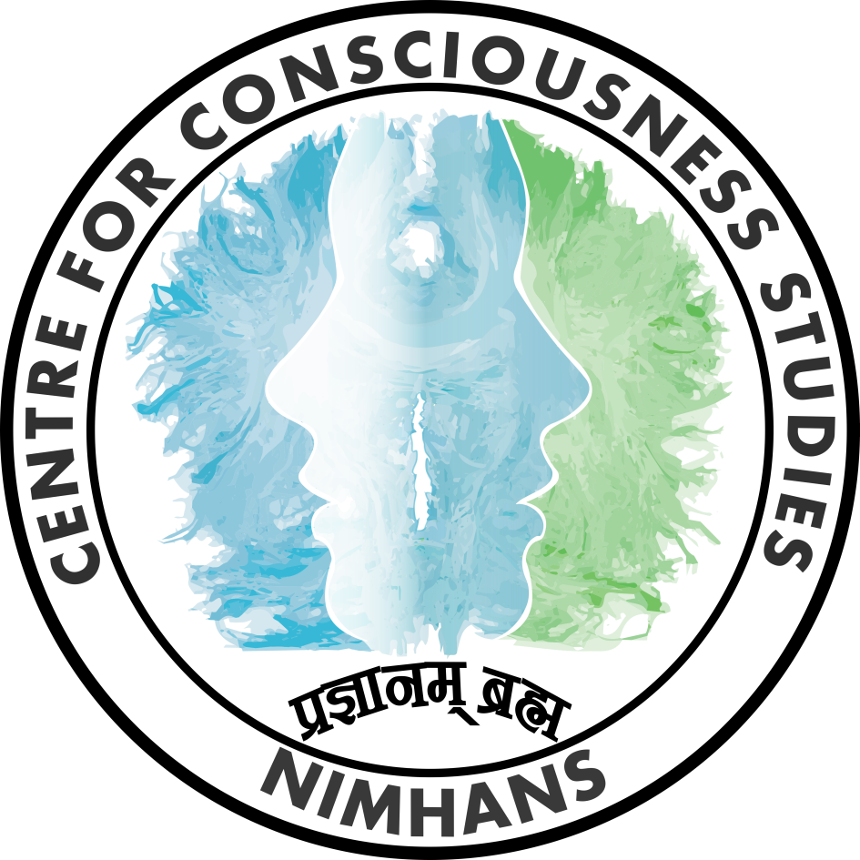
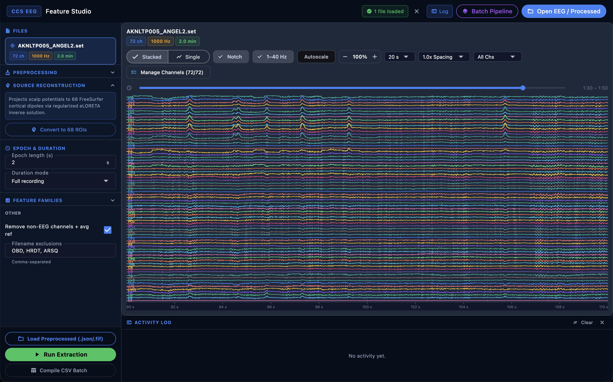
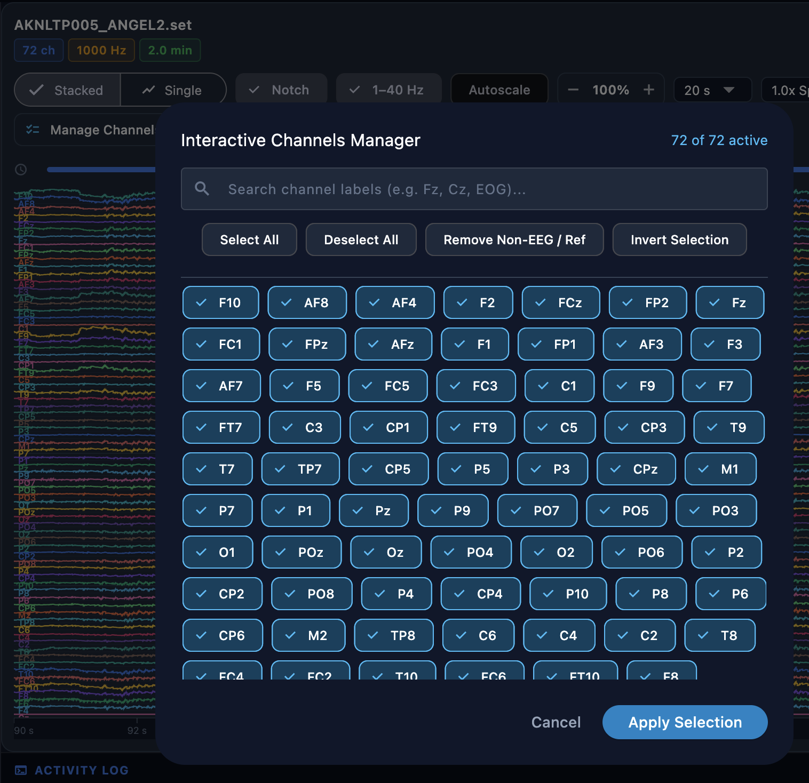
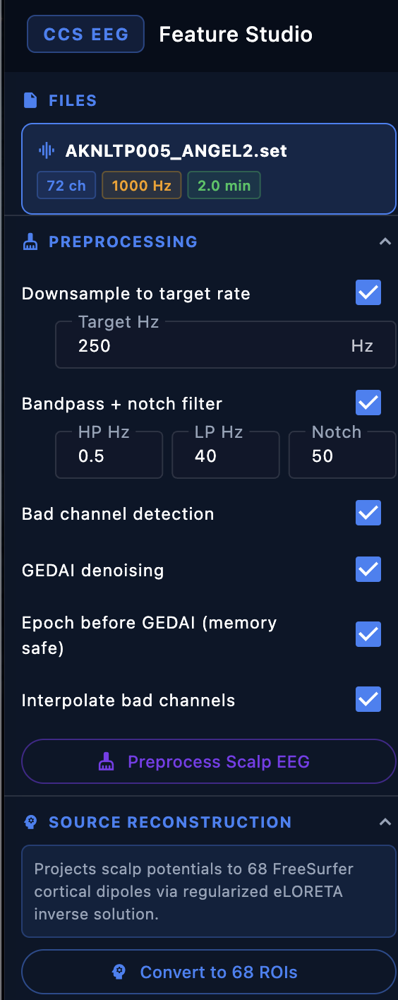
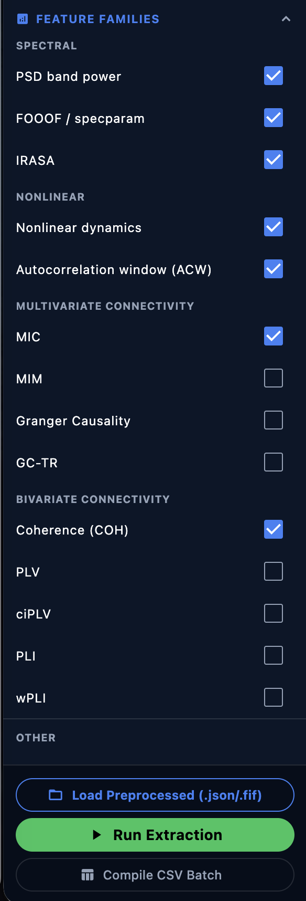
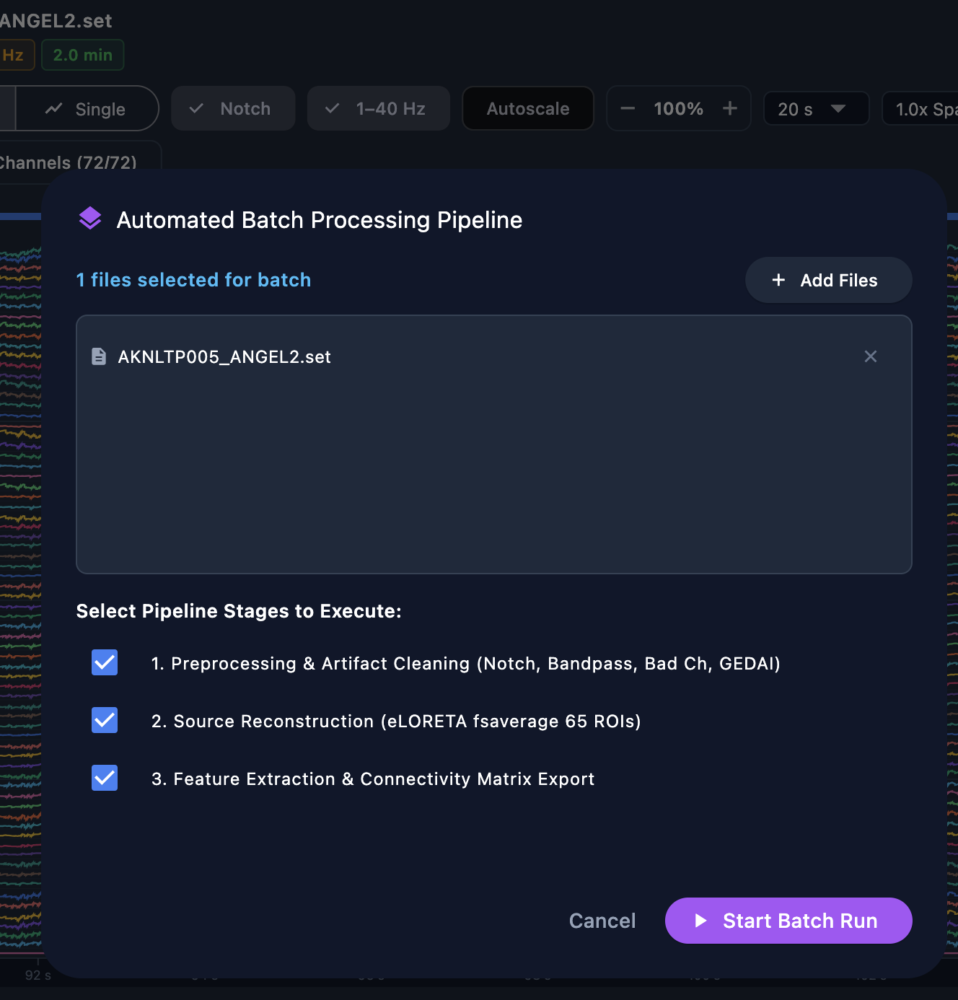

# CCS EEG Studio

<p align="center">
  
</p>

<p align="center">
  Developed by the <b>Team from Centre for Consciousness Studies (CCS)</b>,<br>
  Department of Neurophysiology,<br>
  <b>National Institute of Mental Health and Neurosciences (NIMHANS)</b>, Bangalore, India.
</p>

**Version:** 0.1.0

Welcome to **CCS EEG Studio**, a high-performance, cross-platform desktop application for epoch-wise EEG feature extraction and functional connectivity analysis. It provides a lightweight GUI wrapper for a native Rust computational engine (`ccs-eeg-engine`) that implements spectral, nonlinear, aperiodic, and connectivity analyses with numerical parity to the Python reference extractor (`extract_EEGfeatures_connectivity_20250902_Ver10.0.py`).

Built using **Flutter** for a lightweight, fluid UI and **Rust** for native-speed signal processing, the application reads EDF and EEGLAB SET/FDT recordings and produces combined per-epoch, per-channel CSV outputs without requiring any Python or MATLAB runtime.



---

## About

**CCS EEG Studio** is a standalone desktop platform that automates the CCS EEG feature-extraction pipeline described in `extract_EEGfeatures_connectivity_20250902_Ver10.0.py`. It replaces a multi-hour Python workflow with a Rust-native engine that completes the same extraction in a fraction of the time while producing bit-level-compatible outputs.

The UI and file loaders are ported from [ScoringNidra](https://github.com/arunsasidharan84/ScoringNidra). The workflow is validated against `ccstools.eegfeatures` and `mne-connectivity 0.8` via automated parity test suites that run against real SET/FDT and EDF fixtures.

---

## 📥 Download Standalone Releases

Pre-built installers are compiled automatically via **GitHub Actions** on every push to `main` that contains `[build desktop]` in the commit message, as well as on any tagged release (`v*`) or manual workflow dispatch.

[](https://github.com/arunsasidharan84/CCS_EEGApp/releases)

| Operating System | Package Type | Download Link |
|------------------|--------------|---------------|
| **macOS** | Universal ZIP (.app) | [Download macOS](https://github.com/arunsasidharan84/CCS_EEGApp/releases/download/latest/CCSEEGStudio-macos.zip) |
| **Windows** | x64 Installer EXE | [Download Windows](https://github.com/arunsasidharan84/CCS_EEGApp/releases/download/latest/CCSEEGStudio-Installer.exe) |
| **Linux (Debian/Ubuntu)** | x64 DEB Installer | [Download Linux DEB](https://github.com/arunsasidharan84/CCS_EEGApp/releases/download/latest/CCSEEGStudio-linux-amd64.deb) |
| **Linux (RHEL/AlmaLinux)** | x86_64 RPM Installer | [Download Linux RPM](https://github.com/arunsasidharan84/CCS_EEGApp/releases/download/latest/CCSEEGStudio-linux-x86_64.rpm) |

**Install on Debian / Ubuntu / Linux Mint:**
```sh
sudo apt install ./CCSEEGStudio-linux-amd64.deb
```
The installer registers the application in the desktop menu and adds the `ccseegstudio` command.

**Install on RHEL 9 / AlmaLinux 9 / Rocky Linux 9:**
```sh
sudo dnf install ./CCSEEGStudio-linux-x86_64.rpm
```
Each release is smoke-tested inside an AlmaLinux 9 Docker container before publication.

The `latest` tag is a rolling pre-release — its assets are replaced on each successful build. The download counter badge counts only assets that are still retained in GitHub Releases. Versioned releases such as `v0.2.0` retain their own permanent asset counters.

### For macOS Users
Because the application is signed ad-hoc, you must clear the macOS Gatekeeper quarantine flag after extracting:
1. Download & Extract the zip folder into your **Downloads** folder.
2. Open **Terminal**.
3. Copy, Paste & Run the following command:
    ```sh
    xattr -rd com.apple.quarantine ~/Downloads/CCSEEGStudio.app
    ```
4. Now you are ready to run **CCSEEGStudio.app**.
5. Drag and drop the **CCSEEGStudio.app** into the **Applications** folder so you can open it like any other app in future.

---

## ⚡ Architecture & Performance

CCS EEG Studio uses the same hybrid Flutter + Rust architecture as ScoringNidra:

1. **Flutter UI**: Provides the recording loader panel, channel selector, extraction options, and progress/results views. Heavy computation is never performed on the main Dart thread.
2. **Rust Engine (`ccs-eeg-engine`)**: A standalone CLI binary launched as a subprocess by the Flutter layer via JSON job files. It is the exclusive owner of all mathematics:
   - Multi-threaded epoch dispatch via **Rayon** parallel iterators.
   - Spectral analysis (Welch/Hamming PSD, Morlet wavelet, coherence, PLV) via **rustfft**.
   - Linear algebra for GEDAI / source localization via **nalgebra**.
   - Nonlinear metrics (Sample Entropy, Lempel-Ziv, Hurst) in native Rust.
   - FOOOF and IRASA aperiodic decomposition ported from `analyseNidra`.
3. **Zero-Copy Data Paths**: JSON jobs reference memory-mapped paths; the Rust engine writes CSV rows directly without round-tripping through the Dart heap.
4. **No External Runtimes**: No Python, MATLAB, or R installation is required on the user's machine.

---

## 📂 Repository Layout

```
CCS_EEGApp/
├── lib/                        # Flutter front-end
│   ├── main.dart               # App entry point
│   └── src/
│       ├── app.dart            # Root widget, navigation, theme
│       ├── eeg_viewer.dart     # Multi-channel EEG waveform preview
│       ├── extraction_service.dart  # Rust engine subprocess driver
│       ├── models.dart         # Shared data models (Recording, Options, Row)
│       ├── edf_loader.dart     # EDF/EDF+ file parser
│       ├── fif_loader.dart     # MNE FIF format parser
│       ├── recording_loader.dart    # Unified loader dispatcher
│       ├── set_loader.dart     # EEGLAB SET/FDT format parser
│       └── vhdr_loader.dart    # BrainVision VHDR/EEG/VMRK parser
├── bridge/                     # Rust computation engine
│   ├── Cargo.toml              # Rust package manifest
│   └── src/
│       ├── main.rs             # CLI entry: parses job JSON, dispatches work
│       ├── lib.rs              # Shared types, band definitions, module declarations
│       ├── preprocessing.rs    # Filtering (Chebyshev), re-referencing, CAR
│       ├── spectral.rs         # Welch PSD, FOOOF, IRASA, Morlet wavelets
│       ├── connectivity.rs     # MIC, MIM, GC, GC-TR, coherence, PLV, ciPLV, PLI, wPLI
│       ├── features.rs         # Band-power aggregation and relative PSD
│       ├── nonlinear.rs        # Sample entropy, Hurst, Lempel-Ziv, ACW
│       ├── montage.rs          # GEDAI algorithm, source localization helpers
│       ├── ransac.rs           # Robust line fitting (RANSAC) for aperiodic slopes
│       ├── source_loc.rs       # Source localization utilities
│       ├── signal.rs           # Low-level signal primitives
│       ├── set_loader.rs       # MATLAB v5 MAT file parser (SET/FDT)
│       ├── fif_loader.rs       # FIF file parser
│       └── vhdr_loader.rs      # BrainVision VHDR parser
├── scripts/                    # Build & packaging helper scripts
│   ├── build_macos.sh          # Local macOS app bundle packaging
│   ├── package_linux_deb.sh    # Debian/Ubuntu .deb installer builder
│   ├── package_linux_rpm.sh    # RHEL/AlmaLinux .rpm installer builder
│   └── *.py                    # Parity validation and comparison scripts
├── .github/workflows/
│   └── build.yml               # GitHub Actions CI: build + release for all platforms
├── test/                       # Flutter unit and integration tests
├── parity_test/                # Python vs Rust numerical parity fixtures and data
├── screenshots/                # README screenshots (main, channel_selection, preprocessing_options, feature_extraction_options, batch_analysis)
└── pubspec.yaml                # Flutter dependency manifest
```

---

## 🖥️ Application Screenshots

| Main Window | Channel Selection |
|---|---|
|  |  |

| Preprocessing Options | Feature Extraction Options |
|---|---|
|  |  |



---

## 🔬 Features

### Recording Formats Supported
- **EDF / EDF+** — Standard European Data Format, including Annotations (TAL) channels.
- **EEGLAB SET / FDT** — MATLAB v5 MAT header with external float32 binary data file.
- **BrainVision VHDR / EEG / VMRK** — BrainProducts binary and ASCII formats.
- **MNE FIF** — MNE-Python native format.


### Preprocessing
- **Re-referencing**: Common-average reference (CAR) or arbitrary reference channel subtraction.
- **Channel exclusion**: Automatic removal of common non-EEG channels (ECG, EMG, EOG, Status).
- **Duration modes**: Full recording, fixed interval (start/end seconds), fixed bin size, or the *middle two minutes* mode used by the CCS pipeline.
- **Accepted / rejected interval masks**: Restrict extraction to annotated clean segments.

### Spectral Analysis
- **Relative Welch / Hamming PSD** across 7 frequency bands:

  | Band | Range |
  |------|-------|
  | Delta | 1 – 4 Hz |
  | Theta | 4 – 8 Hz |
  | ThetaAlpha | 6 – 10 Hz |
  | Alpha | 8 – 12 Hz |
  | Beta1 | 12 – 18 Hz |
  | Beta2 | 18 – 30 Hz |
  | Gamma1 | 30 – 40 Hz |

- **FOOOF** (Fitting Oscillations & One-Over-F): Native Rust Levenberg-Marquardt implementation — isolates true oscillatory peaks from the aperiodic 1/f slope. Ported from `analyseNidra`.
- **IRASA** (Irregularly Resampled Auto-Spectral Analysis): Separates fractal and oscillatory PSD components using the geometric resampling approach.


### Nonlinear Metrics
Eight epoch-wise nonlinear complexity and entropy metrics per channel:
- Sample Entropy (SampEn)
- Approximate Entropy (ApEn)
- Hurst Exponent
- Lempel-Ziv Complexity
- Autocorrelation Window (ACW)
- Detrended Fluctuation Analysis (DFA) exponent
- Higuchi Fractal Dimension
- Katz Fractal Dimension


### Connectivity Analysis
Nine connectivity measures computed via Morlet wavelet cross-spectra at the same frequencies and cycle counts used by `mne-connectivity 0.8`:

| Measure | Description |
|---------|-------------|
| **MIC** | Maximized Imaginary Coherence |
| **MIM** | Multivariate Interaction Measure |
| **GC** | Granger Causality (25-lag VAR) |
| **GC-TR** | Time-reversed Granger Causality |
| **Coherence** | Magnitude-squared coherence |
| **PLV** | Phase-Locking Value |
| **ciPLV** | Corrected Imaginary PLV |
| **PLI** | Phase-Lag Index |
| **wPLI** | Weighted Phase-Lag Index |


### Output
- **Combined CSV export**: One row per (epoch, channel, bin) with all enabled feature columns.
- Column names exactly match `ccstools.eegfeatures` output for drop-in pipeline compatibility.
- Export dialog shows output path; the file is saved alongside the source recording by default.


---

## ✅ Scientific Parity

The Rust engine is continuously tested against the Python reference extractor via automated parity scripts in `scripts/` and fixtures in `parity_test/`.

| Module | Python Reference | Maximum Error | Status |
|--------|-----------------|---------------|--------|
| **IRASA band-power** | `ccstools.eegfeatures` | `< 3 × 10⁻¹²` | ✅ Pass |
| **FOOOF band-power** | `ccstools.eegfeatures` | `< 8 × 10⁻⁹` | ✅ Pass |
| **FOOOF fitted params** | `ccstools.eegfeatures` | `< 1 × 10⁻⁴` | ✅ Pass |
| **MIC / MIM** | `mne-connectivity 0.8` | `< 2 × 10⁻¹⁵` | ✅ Pass |
| **Coherence / PLV / ciPLV / PLI / wPLI** | `mne-connectivity 0.8` | `< 2 × 10⁻¹⁵` | ✅ Pass |
| **GC / GC-TR** | `mne-connectivity 0.8` | `< 2 × 10⁻¹²` | ✅ Pass |

Morlet frequencies, cycles, epoch grouping, and 25-lag GC configuration are matched exactly to the Python extractor. Deterministic fixtures at 250 Hz and 1000 Hz sampling rates are used for regression tests.


See [`scripts/compare_parity.py`](scripts/compare_parity.py) and [`scripts/run_parity_test.sh`](scripts/run_parity_test.sh) for instructions on running your own parity validation against a reference dataset.

---

## ⌨️ Keyboard Shortcuts

| Shortcut | Action |
|----------|--------|
| `Ctrl+O` | Open a recording file |
| `Ctrl+E` | Start extraction with current settings |
| `Ctrl+S` | Save / export results CSV |
| `Ctrl+,` | Open settings / configuration panel |
| `Escape` | Cancel running extraction |

---

## 🚀 Running & Building Locally

### Prerequisites

| Tool | Purpose | Install |
|------|---------|---------|
| [Flutter SDK](https://docs.flutter.dev/get-started/install) (stable) | UI framework | See link |
| [Rust Toolchain](https://www.rust-lang.org/tools/install) (`cargo`) | Computation engine | `curl --proto '=https' --tlsv1.2 -sSf https://sh.rustup.rs \| sh` |
| [Inno Setup](https://jrsoftware.org/isinfo.php) (`iscc`) | Windows installer | Windows only |

### 1. Build the Rust Engine

Compile the native `ccs-eeg-engine` binary for your platform:
```sh
cd bridge
cargo build --release
```

The release binary will be at `bridge/target/release/ccs-eeg-engine` (macOS/Linux) or `bridge\target\release\ccs-eeg-engine.exe` (Windows).

### 2. Run the App in Development Mode

```sh
# Install Flutter dependencies
flutter pub get

# Run on macOS
flutter run -d macos

# Run on Windows
flutter run -d windows

# Run on Linux
flutter run -d linux
```

The Flutter app automatically discovers the engine binary from the build tree during development. Ensure `cargo build --release` has been run first.

### 3. Package a Production Release

#### macOS (`.app`)
```sh
# Builds Rust engine + Flutter app and places engine inside the .app bundle
./scripts/build_macos.sh
```

The script produces `build/macos/Build/Products/Release/ccs_eeg_app.app`, ad-hoc signed and ready to distribute.

#### Windows (`.exe` Installer via Inno Setup)
```sh
# Build Flutter Windows release
flutter build windows --release

# Copy engine binary beside the Flutter executable
copy bridge\target\release\ccs-eeg-engine.exe build\windows\x64\runner\Release\

# Create installer (requires Inno Setup)
iscc windows\installer.iss
```

#### Linux (`.deb` Debian/Ubuntu)
```sh
flutter build linux --release

# Copy engine binary into the bundle
cp bridge/target/release/ccs-eeg-engine build/linux/x64/release/bundle/

# Build .deb package
bash scripts/package_linux_deb.sh \
  build/linux/x64/release/bundle \
  dist/CCSEEGStudio-linux-amd64.deb
```

#### Linux (`.rpm` RHEL/AlmaLinux)
```sh
flutter build linux --release

cp bridge/target/release/ccs-eeg-engine build/linux/x64/release/bundle/

bash scripts/package_linux_rpm.sh \
  build/linux/x64/release/bundle \
  dist/CCSEEGStudio-linux-x86_64.rpm
```

---

## 🧪 Running Tests

### Rust Engine Tests
```sh
cd bridge && cargo test
```

Unit tests cover the core spectral, connectivity, nonlinear, and aperiodic modules against deterministic fixtures.

### Flutter Tests
```sh
flutter analyze
flutter test

# Run sample-loader integration test with real EEG data
CCS_EEG_SAMPLE_DATA=/path/to/sampleData flutter test test/sample_loader_test.dart
```

### Parity Tests (Python vs Rust)
Parity scripts compare Rust engine output against the Python reference on real EDF and SET recordings:

```sh
# Full parity run (requires Python + ccstools + mne-connectivity installed)
bash scripts/run_parity_test.sh /path/to/recording.set /path/to/reference_output.csv

# GEDAI parity
bash scripts/run_gedai_parity_test.sh /path/to/recording.set

# Individual comparison scripts
python scripts/compare_parity.py
python scripts/compare_gedai_signals.py
```

---

## 🤖 Automated Builds (GitHub Actions)

Desktop installers are built automatically on every push to `main` or `master` that includes `[build desktop]` in the commit message, on any `v*` tag push, or via manual workflow dispatch.

**To trigger a build from a commit:**
```
git commit -m "feat: improve connectivity speed [build desktop]"
git push
```

The workflow (`.github/workflows/build.yml`) runs three parallel jobs:

| Job | Runner | Output |
|-----|--------|--------|
| `build-macos` | `macos-15` | `CCSEEGStudio-macos.zip` |
| `build-windows` | `windows-2022` | `CCSEEGStudio-Installer.exe` |
| `build-linux` | `ubuntu-22.04` | `CCSEEGStudio-linux-amd64.deb` + `CCSEEGStudio-linux-x86_64.rpm` |

After all three build jobs complete, a `release` job assembles all artifacts and creates or updates the `latest` GitHub Release, or creates a permanent versioned release for `v*` tags.

The Linux RPM is smoke-tested inside an **AlmaLinux 9** Docker container before upload to confirm library resolution on RHEL-family systems.

---

## 📋 Parity Validation Scripts Reference

| Script | Purpose |
|--------|---------|
| [`scripts/compare_parity.py`](scripts/compare_parity.py) | Full feature-by-feature comparison of Rust vs Python output CSVs |
| [`scripts/compare_filter.py`](scripts/compare_filter.py) | Filter kernel and output comparison |
| [`scripts/compare_gedai_signals.py`](scripts/compare_gedai_signals.py) | GEDAI source separation comparison |
| [`scripts/run_parity_test.sh`](scripts/run_parity_test.sh) | Shell driver: runs Rust engine + Python reference then compares |
| [`scripts/run_gedai_parity_test.sh`](scripts/run_gedai_parity_test.sh) | Shell driver for GEDAI-specific parity |
| [`scripts/python_extract_headlessly.py`](scripts/python_extract_headlessly.py) | Python reference extractor (headless, no GUI) |
| [`scripts/test_pipeline_steps.py`](scripts/test_pipeline_steps.py) | Step-by-step pipeline comparison |
| [`scripts/test_wavelet.py`](scripts/test_wavelet.py) | Morlet wavelet cross-spectra validation |
| [`scripts/test_gevd.py`](scripts/test_gevd.py) | Generalized eigenvalue decomposition validation |

---

## 🔗 Related Repositories

| Repository | Description |
|------------|-------------|
| [ScoringNidra](https://github.com/arunsasidharan84/ScoringNidra) | Sleep EEG visualization, manual scoring, automated staging, and AnalyseNidra quantitative reports |

---

## 📄 License

Proprietary — Centre for Consciousness Studies, NIMHANS, Bangalore, India.
All rights reserved.
