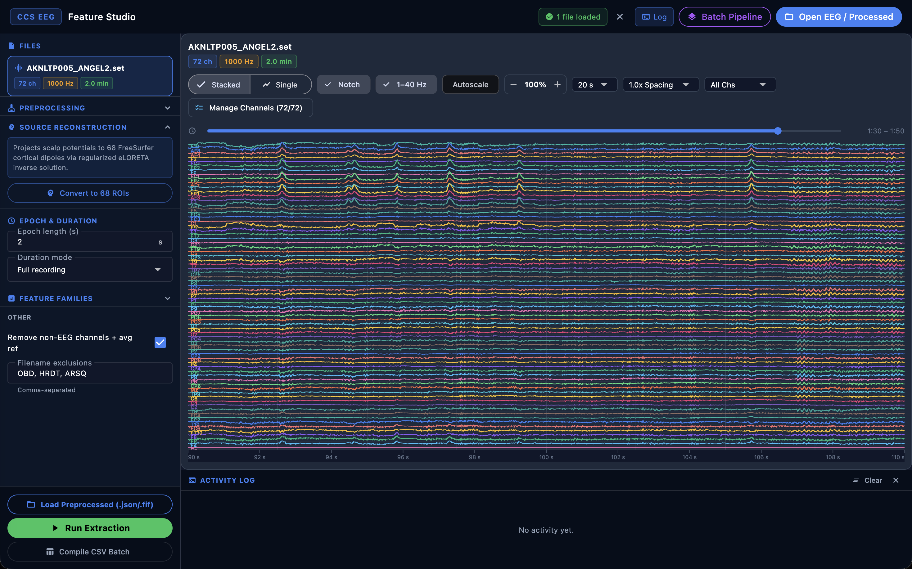
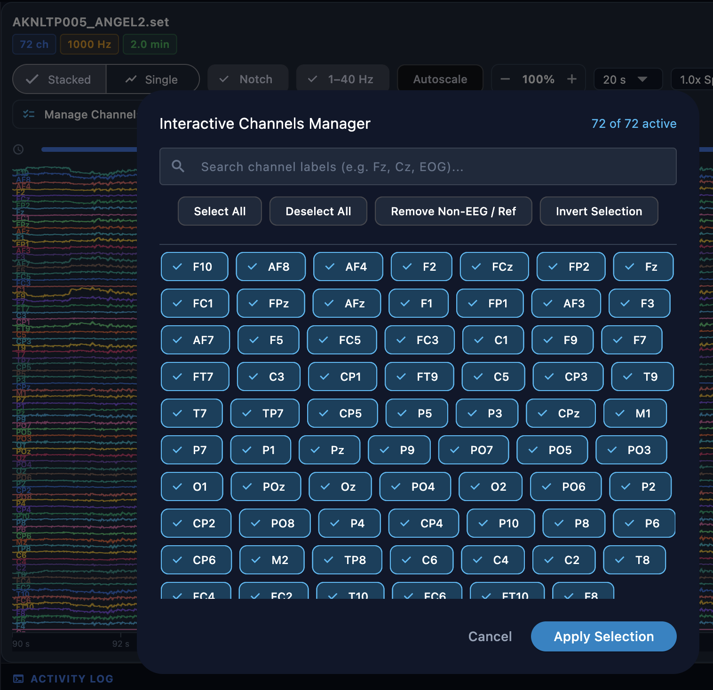
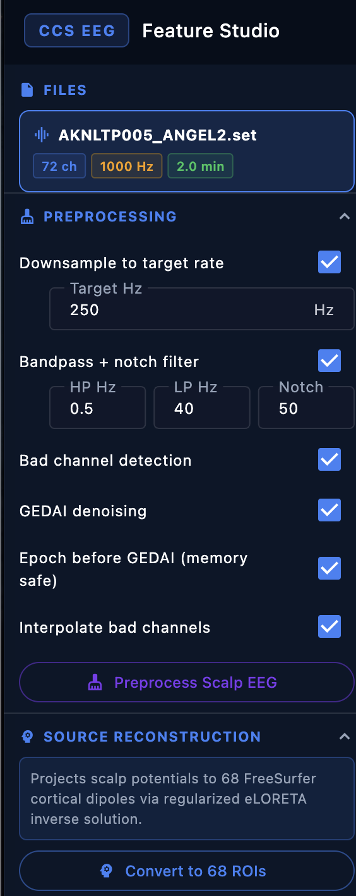
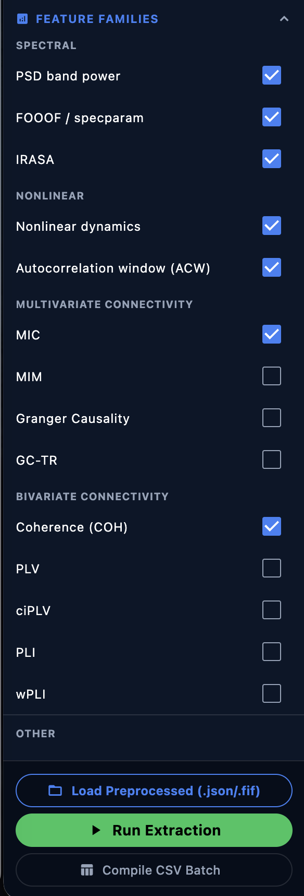
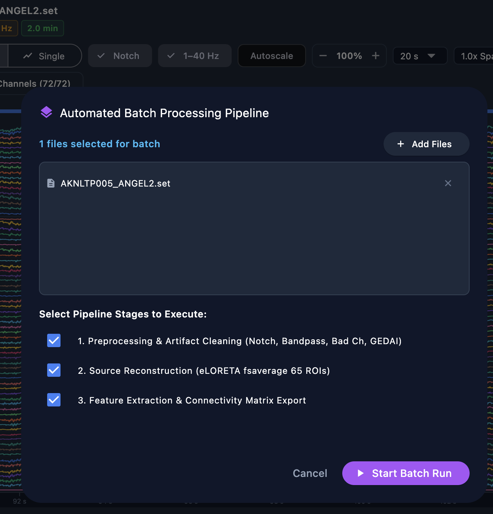

<p align="center">
  
</p>

<h1 align="center">CCS EEG Studio</h1>

<p align="center">
  <b>Native-speed EEG preprocessing, feature extraction, connectivity, statistics, and reporting</b>
</p>

<p align="center">
  A Research & Engineering Collaboration of<br>
  <b>Centre for Consciousness Studies (CCS)</b>, Department of Neurophysiology,<br>
  <b>National Institute of Mental Health and Neurosciences (NIMHANS)</b>, Bengaluru, India<br>
  🤝<br>
  <a href="https://axxonet.com/"><b>Axxonet</b></a>
</p>

<p align="center">
  <a href="#-quick-download"><b>📥 Download App</b></a> &nbsp;•&nbsp;
  <a href="#about"><b>About</b></a> &nbsp;•&nbsp;
  <a href="#-features"><b>Features</b></a> &nbsp;•&nbsp;
  <a href="#-running--building-locally"><b>Build from Source</b></a> &nbsp;•&nbsp;
  <a href="CHANGELOG.md"><b>Release Notes</b></a> &nbsp;•&nbsp;
  <a href="https://github.com/arunsasidharan84/CCS_EEGStudio/issues"><b>Report Issue</b></a>
</p>

---

### 📥 Quick Download

Pre-built standalone desktop installers and application bundles are published through GitHub Releases:

| Platform | Package Type | Direct Download Link |
| :--- | :--- | :--- |
| **macOS** | Universal app bundle (macOS 12+) | [CCSEEGStudio-macos.zip](https://github.com/arunsasidharan84/CCS_EEGStudio/releases/latest/download/CCSEEGStudio-macos.zip) |
| **Windows** | 64-bit installer (Windows 10/11) | [CCSEEGStudio-Installer.exe](https://github.com/arunsasidharan84/CCS_EEGStudio/releases/latest/download/CCSEEGStudio-Installer.exe) |
| **Linux (Debian / Ubuntu)** | amd64 DEB package | [CCSEEGStudio-linux-amd64.deb](https://github.com/arunsasidharan84/CCS_EEGStudio/releases/latest/download/CCSEEGStudio-linux-amd64.deb) |
| **Linux (RHEL / AlmaLinux)** | x86_64 RPM package | [CCSEEGStudio-linux-x86_64.rpm](https://github.com/arunsasidharan84/CCS_EEGStudio/releases/latest/download/CCSEEGStudio-linux-x86_64.rpm) |

> 📦 **All Releases & Checksums:** Every release includes [`SHA256SUMS.txt`](https://github.com/arunsasidharan84/CCS_EEGStudio/releases/latest/download/SHA256SUMS.txt) for cryptographic verification. View all packages on the **[GitHub Releases Page](https://github.com/arunsasidharan84/CCS_EEGStudio/releases/latest)**.  
> 🔄 **In-App Upgrades:** Once installed, choose **Updates** in the app's top bar to check, download, and apply the correct update package automatically.  
> 🍏 **macOS Gatekeeper:** For first-time launch instructions, see [macOS Gatekeeper Setup](#macos-gatekeeper).

<p align="center">
  
</p>

---

## About

**CCS EEG Studio** turns research EEG recordings into reproducible, analysis-ready outputs without requiring Python or MATLAB on the end user's computer. A Flutter desktop interface orchestrates a native Rust engine for preprocessing, source projection, epoch-wise features, functional connectivity, ERP analysis, microstates, topographic statistics, plots, and PDF reports.

> The algorithms are ported from [`ccs_toolbox`](https://github.com/arunsasidharan84/ccs_toolbox) and continuously validated against Python reference implementations and MNE Connectivity.

### Why CCS EEG Studio?

| | Capability |
| :---: | :--- |
| ⚡ | Native Rust processing with parallel epoch dispatch via Rayon |
| 🧠 | Spectral, aperiodic, nonlinear, connectivity, ERP, source-space, and microstate analysis |
| 📊 | Channel-level CSVs, scalp maps, statistics, plots, and publication-ready PDF reports |
| 📁 | EDF/EDF+, EEGLAB SET/FDT, MNE FIF, FieldTrip MAT, BrainVision, and portable CCS EEG files |
| 〰️ | SleepStudio-style light waveform canvas with uniform traces and EEGLAB-style stitched epoch scrolling |
| 🧹 | Configurable GEDAI window/epoch size for continuous and memory-safe preprocessing |
| 🔁 | Single-recording exploration and unattended batch pipelines share one configuration |
| ⬆️ | Built-in update checker downloads and installs verified packages directly from GitHub Releases |

---

## 🌟 What's New in Version 1.2.5

- **Synchronized microstate explorer** with aligned sequence, EEG, and state-similarity timelines; selectable waveform density; and toggleable state traces.
- **ERP scalp maps** at a selected time point or averaged time window, including A, B, B−A, Welch-t, and FDR-corrected electrode significance views.
- **Safer recording tabs** for long filenames and clearer percentage-form microstate transition matrices.
- **Reproducible multi-platform releases** built by GitHub Actions with pinned Flutter SDK, cryptographic checksums, and version notes.

> 📜 See the complete **[CHANGELOG.md](CHANGELOG.md)** for detailed feature notes across all releases.

---

## 🧭 Two Workflow Modes

The app provides two dedicated operating modes sharing a unified configuration engine:

| | **Single Recording** | **Batch Pipeline** |
| :--- | :--- | :--- |
| **Input** | Exactly one file | A queue of many files or recursive directory |
| **Waveform viewer** | ✅ Yes, real-time inspection | ❌ No, optimized for throughput |
| **Run granularity** | One button per stage — stop, inspect, continue | Per stage, or all stages in sequence |
| **Channel types** | Auto-detected, reviewable and overridable per channel | Auto-detected per file |
| **Outputs** | One CSV + PDF + plots for that recording | One CSV/PDF/plot folder **per file**, plus pooled CSV and group overlay plot |
| **Use case** | Exploring data, tuning cleaning settings, dialling in parameters | Unattended production and cohort processing |

Both modes bind to the **same** analysis configuration object. Every option (preprocessing, source localisation, all fourteen feature families, epoching, duration mode, plotting) appears in both places, and a setting tuned on one recording carries directly over to the batch queue.

### Pipeline Stages
1. **Preprocessing** — downsampling, zero-phase filtering, bad-channel detection, GEDAI artifact removal, interpolation.
2. **Source Space** *(optional)* — eLORETA cortical projection to 68 Desikan-Killiany ROIs.
3. **Feature Extraction** — epoching, multi-domain feature families, CSV outputs.
4. **Plots & Reports** — topoplots, time-series plots, group overlays, publication-grade PDF report.

### Channel Types
Non-EEG channels are **auto-detected from their labels** on load — ECG, EOG, EMG, GSR, respiration, PPG, motion/accelerometer, references and trigger channels are each recognized as their own kind. The **Channel Types** panel in Single Recording mode lists every channel with its detected kind and lets you override any of them; whatever you set is exactly what reaches the engine.

---

## 🔬 Features

### Recording Formats Supported
- **EDF / EDF+** — Standard European Data Format, including Annotations (TAL) channels.
- **EEGLAB SET / FDT** — Standalone embedded `.set` data or `.set` plus external float32 `.fdt`.
- **FieldTrip MAT** — MATLAB v5 `ftData` structs with continuous numeric trials or cell-array trials.
- **BrainVision VHDR / EEG / VMRK** — BrainProducts binary and ASCII formats.
- **MNE FIF** — Continuous raw and epoched MNE-Python FIF recordings.
- **CCS EEG JSON** — Portable preprocessed or epoched recordings produced by the app.

### Preprocessing
- **Re-referencing**: Common-average reference (CAR) or arbitrary reference channel subtraction.
- **Channel exclusion**: Auto-detection of non-EEG channels (ECG, EOG, EMG, GSR, respiration, PPG, motion, references, triggers), reviewable and overridable per channel.
- **Duration modes**: Full recording, fixed interval (start/end seconds), fixed bin size, or the *middle two minutes* mode used by the CCS pipeline.
- **Accepted / rejected interval masks**: Restrict extraction to annotated clean segments.
- **GEDAI windows**: Explicitly configure the window/epoch size used for GEDAI, with memory-safe pre-epoching for long recordings.
- **Stimulus epochs**: Cut event-locked trials after filtering and before GEDAI, retain marker labels and epoch timing, and optionally apply baseline correction.

### ERP Analysis
- Define conditions from marker chips or regular expressions.
- Plot condition means ± SEM and test temporal clusters by permutation.
- Compute component-window Welch tests, Cohen's d, and bootstrap confidence intervals.
- Map both a selected latency and a time-window average over the scalp for condition A, condition B, B−A, and Welch t.
- Mark electrodes passing Benjamini–Hochberg FDR correction.

### EEG Microstates
- Four- to eight-state solutions with canonical A–G template assignment.
- GFP, occurrence, duration, coverage, GEV, spatial correlation, sequence complexity, entropy production, and transition summaries.
- Synchronized sequence, waveform, and state-similarity exploration with one absolute-time axis.

### Spectral Analysis
- **Relative Welch / Hamming PSD** across 7 frequency bands:
  - Delta (1–4 Hz), Theta (4–8 Hz), ThetaAlpha (6–10 Hz), Alpha (8–12 Hz), Beta1 (12–18 Hz), Beta2 (18–30 Hz), Gamma1 (30–40 Hz).
- **FOOOF** (Fitting Oscillations & One-Over-F): Native Rust Levenberg-Marquardt implementation — isolates true oscillatory peaks from the aperiodic 1/f slope.
- **IRASA** (Irregularly Resampled Auto-Spectral Analysis): Separates fractal and oscillatory PSD components using geometric resampling.

### Nonlinear Metrics
Eight epoch-wise nonlinear complexity and entropy metrics per channel:
- Sample Entropy (SampEn), Approximate Entropy (ApEn), Hurst Exponent, Lempel-Ziv Complexity, Autocorrelation Window (ACW), Detrended Fluctuation Analysis (DFA) exponent, Higuchi Fractal Dimension, Katz Fractal Dimension.

### Connectivity Analysis
Nine connectivity measures computed via Morlet wavelet cross-spectra matching `mne-connectivity 0.8`:
- **MIC** (Maximized Imaginary Coherence), **MIM** (Multivariate Interaction Measure), **GC** (Granger Causality 25-lag VAR), **GC-TR** (Time-reversed GC), **Coherence**, **PLV**, **ciPLV**, **PLI**, **wPLI**.

### Outputs & Plot Layout
- **Per-file CSV export**: `<recording>.features.csv` for every input, with one row per (epoch, channel, bin) and all enabled feature columns.
- **Combined CSV export**: `Batch_features.csv` pooling every recording with provenance metadata (`subjid`, `sessn`, `condn`).
- **Publication-grade PDF reports & Scalp Maps**: High-resolution vector visualizations and executive summaries.

---

## 🖥️ Application Screenshots

| Main Workspace | Channel Selection & Overrides |
| :---: | :---: |
|  |  |

| Preprocessing Configuration | Feature Extraction Families |
| :---: | :---: |
|  |  |

| Batch Analysis Pipeline |
| :---: |
|  |

---

## ⚡ Architecture

CCS EEG Studio uses a decoupled Flutter + Rust architecture:

1. **Flutter UI**: Provides recording navigation, channel selection, parameter tuning, progress visualization, and report generation.
2. **Rust Engine (`ccs-eeg-engine`)**: A standalone CLI binary launched as a subprocess via structured JSON job files:
   - Parallel epoch computation via **Rayon** multi-threading.
   - Spectral analysis (Welch PSD, Morlet wavelets, coherence, PLV) via **rustfft**.
   - Linear algebra for GEDAI and source localization via **nalgebra**.
   - Native implementations of FOOOF, IRASA, and nonlinear metrics.
3. **Dart Analysis Layer**: ERP statistics, permutation clustering, topographic interpolation, and PDF reporting in background isolates.
4. **Zero External Runtimes**: Self-contained executable without Python, MATLAB, or R dependencies.

```
CCS_EEGStudio/
├── lib/                        # Flutter front-end
│   ├── main.dart               # App entry point
│   └── src/
│       ├── app.dart            # Root widget, navigation, theme
│       ├── eeg_viewer.dart     # Multi-channel EEG waveform preview
│       ├── extraction_service.dart  # Rust engine subprocess driver
│       ├── models.dart         # Shared data models (Recording, Options, Row)
│       ├── edf_loader.dart     # EDF/EDF+ file parser
│       ├── fif_loader.dart     # MNE FIF format parser
│       ├── fieldtrip_mat_loader.dart # FieldTrip MAT integration
│       ├── recording_loader.dart    # Unified loader dispatcher
│       ├── set_loader.dart     # EEGLAB SET/FDT format parser
│       ├── update_checker.dart # GitHub release updater
│       └── vhdr_loader.dart    # BrainVision VHDR/EEG/VMRK parser
├── bridge/                     # Rust computation engine
│   ├── Cargo.toml              # Rust package manifest
│   └── src/
│       ├── lib.rs              # Shared types, band definitions, module declarations
│       ├── main.rs             # Job dispatch and output writing
│       ├── fieldtrip_loader.rs # FieldTrip structs and trial conversion
│       ├── mat_v5.rs           # MATLAB v5 structs, cells, chars, numerics
│       ├── mne_fif.rs          # Raw + epoched MNE FIF loading
│       ├── microstates.rs      # Microstate analysis
│       └── stats.rs            # Statistical utilities
├── scripts/                    # Build & packaging helper scripts
├── test/                       # Flutter unit and integration tests
├── parity_test/                # Python vs Rust numerical parity fixtures
└── screenshots/                # Application documentation screenshots
```

---

## ✅ Scientific Validation

The Rust engine is continuously verified against Python reference implementations (`ccstools.eegfeatures`, MNE-Python, and `mne-connectivity`):
* PSD relative band powers, IRASA oscillatory powers, nonlinear metrics, ACW, and bivariate connectivity agree to floating-point precision on reference datasets.
* ERP waveforms and permutation cluster statistics are regression-tested against reference pipelines.
* Topographic scalp interpolation and FDR significance tests have dedicated synthetic and empirical test suites.

See [`scripts/compare_parity.py`](scripts/compare_parity.py) and [`scripts/run_parity_test.sh`](scripts/run_parity_test.sh) for instructions on running parity validation suites.

---

## ⌨️ Keyboard Shortcuts

| Shortcut | Action |
| :--- | :--- |
| `Ctrl+O` | Open a recording file |
| `Ctrl+E` | Start extraction with current settings |
| `Ctrl+S` | Save / export results CSV |
| `Ctrl+,` | Open settings / configuration panel |
| `Escape` | Cancel running extraction |

---

## 🚀 Running & Building Locally

### Prerequisites
* [Flutter SDK](https://docs.flutter.dev/get-started/install) (stable channel)
* [Rust Toolchain](https://www.rust-lang.org/tools/install) (`cargo` and `rustc`)
* For Windows installer: [Inno Setup](https://jrsoftware.org/isinfo.php) (`iscc` compiler)

### 1. Build the Rust Engine
Compile the native `ccs-eeg-engine` binary:
```sh
cd bridge
cargo build --release
cd ..
```

### 2. Run the App in Development Mode
```sh
# Install Flutter dependencies
flutter pub get

# Run on macOS
flutter run -d macos

# Run on Windows
flutter run -d windows

# Run on Linux
flutter run -d linux
```

### 3. Package Production Release
```sh
# macOS (.app bundle)
./scripts/build_macos.sh

# Windows (.exe Installer via Inno Setup)
flutter build windows --release
copy bridge\target\release\ccs-eeg-engine.exe build\windows\x64\runner\Release\
iscc windows\installer.iss

# Linux Debian/Ubuntu (.deb)
flutter build linux --release
cp bridge/target/release/ccs-eeg-engine build/linux/x64/release/bundle/
bash scripts/package_linux_deb.sh build/linux/x64/release/bundle dist/CCSEEGStudio-linux-amd64.deb

# Linux RHEL/AlmaLinux (.rpm)
flutter build linux --release
cp bridge/target/release/ccs-eeg-engine build/linux/x64/release/bundle/
bash scripts/package_linux_rpm.sh build/linux/x64/release/bundle dist/CCSEEGStudio-linux-x86_64.rpm
```

### macOS Gatekeeper
If macOS blocks an ad-hoc-signed build after extraction, run:
```sh
xattr -rd com.apple.quarantine ~/Downloads/CCSEEGStudio.app
```

---

## 🧪 Running Tests

```sh
# Rust Engine Tests
cd bridge && cargo test && cd ..

# Flutter Analyzer & Tests
flutter analyze
flutter test

# Python vs Rust Parity Tests
bash scripts/run_parity_test.sh /path/to/recording.set /path/to/reference_output.csv
```

---

## 🤝 Research Collaboration & Acknowledgments

**CCS EEG Studio** is developed as a joint research and neurotechnology engineering collaboration by:

* **Centre for Consciousness Studies (CCS)**  
  *Department of Neurophysiology*,  
  **National Institute of Mental Health and Neurosciences (NIMHANS)**, Bengaluru, India.  
  *Pioneering neurophysiology research into consciousness, cognitive states, meditation, and computational EEG analytics.*

* **Axxonet** ([https://axxonet.com/](https://axxonet.com/))  
  *Pioneering medical technology, EEG & neurophysiology instrumentation, and cognitive research solutions.*

---

## 🔗 Related Repositories

| Repository | Description |
| :--- | :--- |
| [CCS Sleep Studio](https://github.com/arunsasidharan84/CCS_SleepStudio) | Sleep EEG visualization, manual staging, 9 automated AI models, and AnalyseNidra quantitative reports |
| [CCS Mobile Studio](https://github.com/arunsasidharan84/CCS_MobileStudio) | Mobile/desktop neurophysiology acquisition, stimulation, ANGEL ERP, and cognitive experiments |
| [CCS PPG Studio](https://github.com/arunsasidharan84/CCS_PPGStudio) | Clinical and research photoplethysmography analytics, gapless quality ribbon, and HRV dynamics |

---

## 📄 License

Proprietary — Centre for Consciousness Studies, NIMHANS, Bengaluru, India. All rights reserved.
